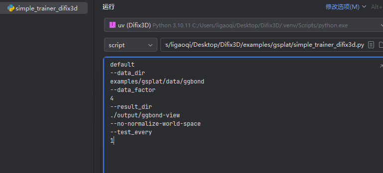
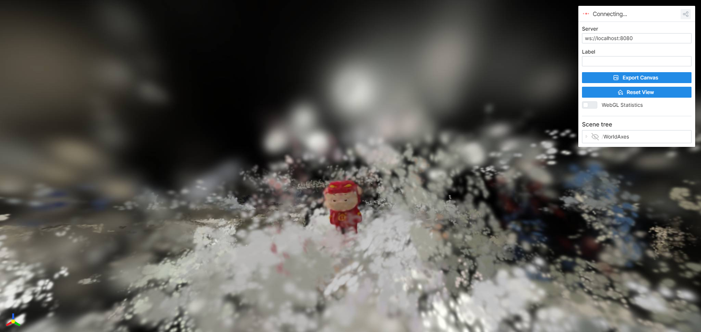

# Difix3D 3dgs Demo

## Original Paper Information
**Difix3D+: Improving 3D Reconstructions with Single-Step Diffusion Models**  
[Jay Zhangjie Wu*](https://zhangjiewu.github.io/), [Yuxuan Zhang*](https://scholar.google.com/citations?user=Jt5VvNgAAAAJ&hl=en), [Haithem Turki](https://haithemturki.com/), [Xuanchi Ren](https://xuanchiren.com/), [Jun Gao](https://www.cs.toronto.edu/~jungao/),  
[Mike Zheng Shou](https://sites.google.com/view/showlab/home?authuser=0), [Sanja Fidler](https://www.cs.utoronto.ca/~fidler/), [Zan Gojcic†](https://zgojcic.github.io/), [Huan Ling†](https://www.cs.toronto.edu/~linghuan/) _(*/† equal contribution/advising)_  
CVPR 2025 (Oral)  
[Project Page](https://research.nvidia.com/labs/toronto-ai/difix3d/) | [Paper](https://arxiv.org/abs/2503.01774) | [Model](https://huggingface.co/nvidia/difix) | [Demo](https://huggingface.co/spaces/nvidia/difix)

<div align="center">
  
</div>

## Setup using `uv`
make sure you install `uv` first
```bash
git clone git@github.com:ligaoqi2/Difix3d-3dgs-demo.git
cd Difix-splat-demo
uv sync
```

## Quickstart (diffusers)

```bash
python src/diffusers_demo.py
```

## Quickstart (Difix3D: Progressive 3D update)

### Data Format

The data should be organized in the following structure:

( You can use my [3dgs repo](https://github.com/ligaoqi2/Simple-3dgs-video-demo) 
to get the necessary data easily )

```
DATA_DIR/
├── {YOUR_SCENE_NAME}
│   ├── colmap
│   │   ├── sparse
│   │   │   └── 0
│   │   │       ├── cameras.bin
│   │   │       ├── database.db
│   │   │       └── ...
│   ├── images
│   │   ├── 0001.png
│   │   ├── 0002.png
│   │   ├── ...
│   │   ├── 0200.png
│   │   ├── 0201.png
│   │   └── ...
│   ├── images_2
│   ├── images_4
│   └── images_8
```

### Run Difix3D finetuning with 3dgs.
```bash
DATA=${YOUR_DATA_DIR_NAME}
DATA_FACTOR=4
OUTPUT_DIR=output/${YOUR_OUTPUT_DIR_NAME}

CUDA_VISIBLE_DEVICES=0 python examples/gsplat/simple_trainer_difix3d.py default \
    --data_dir ${DATA} --data_factor ${DATA_FACTOR} \
    --result_dir ${OUTPUT_DIR} --no-normalize-world-space --test_every 1
```
 - You can refer to my pycharm configuration like following:

</img>

Then you can open `http://localhost:8080` to see the generating process like following.

</img>

### BTW
 - Due to the GPU memory limitation, I have to set max_steps 10_000 at simple_trainer_difix3d.py line 91, you could set it larger if you have enough GPU memory to get a better result.

 - Other operations like training, testing, and inference can be found in the origin [Difix3D+](https://github.com/nv-tlabs/Difix3D)

## Acknowledgements

- [diffusers](https://github.com/huggingface/diffusers)
- [img2img-turbo](https://github.com/GaParmar/img2img-turbo)
- [nerfstudio](https://github.com/nerfstudio-project/nerfstudio)
- [gsplat](https://github.com/nerfstudio-project/gsplat)
- [DL3DV-10K](https://github.com/DL3DV-10K/Dataset)
- [nerfbusters](https://github.com/ethanweber/nerfbusters)
- [Difix3D+](https://github.com/nv-tlabs/Difix3D)

## License/Terms of Use:

The use of the model and code is governed by the NVIDIA License. See [LICENSE.txt](LICENSE.txt) for details.
Additional Information:  [LICENSE.md · stabilityai/sd-turbo at main](https://huggingface.co/stabilityai/sd-turbo/blob/main/LICENSE.md)

## Contact
```
ligaoqi02@gmail.com
```